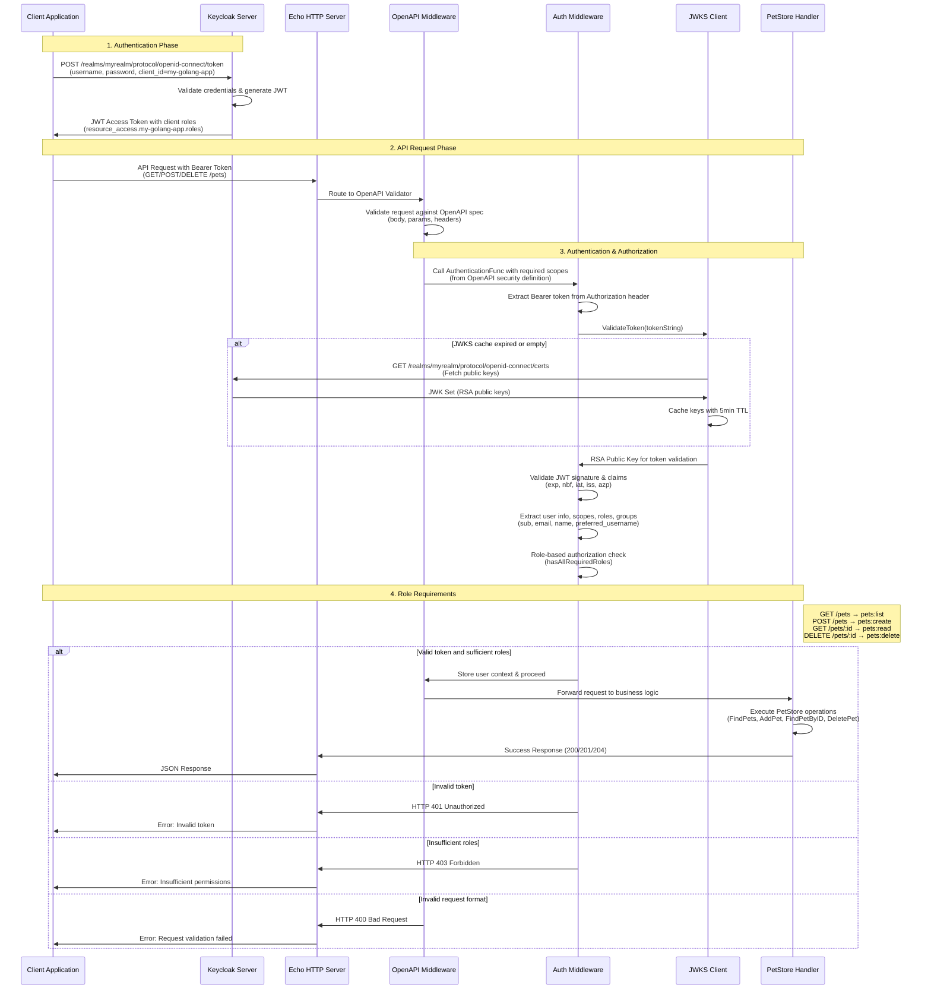

# Spec Driven Development with Keycloak OIDC for Security

A complete example demonstrating how to build a secure REST API using OpenAPI specifications, Go code generation, and Keycloak for authentication and authorization.

## Table of Contents

- [Spec Driven Development with Keycloak OIDC for Security](#spec-driven-development-with-keycloak-oidc-for-security)
  - [Table of Contents](#table-of-contents)
  - [Overview](#overview)
  - [Goals](#goals)
  - [Prerequisites](#prerequisites)
  - [Authentication and Authorization Flow](#authentication-and-authorization-flow)
  - [Quick Start](#quick-start)
  - [Setting Up Keycloak](#setting-up-keycloak)
    - [Step 1: Start Keycloak Server](#step-1-start-keycloak-server)
    - [Step 2: Access Keycloak Admin Console](#step-2-access-keycloak-admin-console)
    - [Step 3: Create Realm](#step-3-create-realm)
    - [Step 4: Create User](#step-4-create-user)
    - [Step 5: Verify User Setup](#step-5-verify-user-setup)
    - [Step 6: Create Client Application](#step-6-create-client-application)
    - [Step 7: Create Client Roles](#step-7-create-client-roles)
    - [Step 8: Assign Roles to User](#step-8-assign-roles-to-user)
    - [Step 9: Verify Token Generation](#step-9-verify-token-generation)
    - [Step 10: Verify Token Claims](#step-10-verify-token-claims)
  - [Generate Go code from the OpenAPI spec](#generate-go-code-from-the-openapi-spec)
  - [Run the Go application](#run-the-go-application)
  - [Test the API and AuthN/AuthZ](#test-the-api-and-authnauthz)
    - [Authentication Test](#authentication-test)
    - [API Endpoint Tests](#api-endpoint-tests)
      - [1. List All Pets (GET /pets)](#1-list-all-pets-get-pets)
      - [2. Create a New Pet (POST /pets)](#2-create-a-new-pet-post-pets)
      - [3. Get Specific Pet (GET /pets/{id})](#3-get-specific-pet-get-petsid)
      - [4. Delete Pet (DELETE /pets/{id})](#4-delete-pet-delete-petsid)
    - [Error Scenarios](#error-scenarios)
      - [Missing Authorization Header](#missing-authorization-header)
      - [Invalid Token](#invalid-token)
      - [Insufficient Permissions](#insufficient-permissions)
  - [Project Structure](#project-structure)
    - [Key Components](#key-components)
  - [References](#references)

## Overview

This project showcases a modern approach to building secure APIs by combining:

- **Spec-First Development**: Define your API contract using OpenAPI 3.0
- **Code Generation**: Automatically generate Go server code using `oapi-codegen`
- **Enterprise Security**: Integrate with Keycloak for OIDC authentication
- **Role-Based Access Control**: Implement fine-grained authorization using JWT roles

## Goals

This repository demonstrates the following key concepts:

1. **OpenAPI Security Integration**: Creating OpenAPI specs with OIDC security definitions
2. **Code Generation**: Using `oapi-codegen` to generate type-safe Go server code
3. **Identity Provider Setup**: Configuring Keycloak for OIDC authentication
4. **JWT Validation**: Implementing JWKS-based token validation with caching
5. **Role-Based Authorization**: Enforcing fine-grained permissions using JWT claims

## Prerequisites

Before getting started, ensure you have the following installed:

- Go 1.24+
- Docker & Docker Compose
- Make
- curl & jq

```bash
# Verify prerequisites
go version
docker --version
docker-compose --version
make --version
curl --version
jq --version
```

## Authentication and Authorization Flow

The following diagram illustrates the complete authentication and authorization flow:



## Quick Start

Get up and running in under 5 minutes:

```bash
# 1. Clone and setup
git clone <repository-url>
cd oapi-codegen-keycloak-oidc

# 2. Install dependencies
go mod tidy

# 3. Start Keycloak
docker-compose up -d

# 4. Generate Go code from OpenAPI spec
make generate

# 5. Run the application
make run
```

The API will be available at `http://localhost:9000` with Swagger UI at `http://localhost:9000/swagger/`.

## Setting Up Keycloak

### Step 1: Start Keycloak Server

```bash
docker-compose up -d
```

### Step 2: Access Keycloak Admin Console

1. Open [Keycloak Admin Console](http://localhost:8080/admin)
2. Login with default credentials (check `docker-compose.yml` for credentials)

### Step 3: Create Realm

1. Click **"Create Realm"** button
2. Set **Realm name**: `myrealm`
3. Click **"Create"**

### Step 4: Create User

1. Navigate to **Users** → **Add user**
2. Set **Username**: `myuser`
3. Click **"Create"**
4. Go to **Credentials** tab
5. Set **Password**: `mypassword`
6. Turn off **"Temporary"** toggle
7. Click **"Set password"**

### Step 5: Verify User Setup

Test user login at [Keycloak Account Console](http://localhost:8080/realms/myrealm/account):

- Username: `myuser`
- Password: `mypassword`

### Step 6: Create Client Application

1. Navigate to **Clients** → **Create client**
2. Configure the client:
   - **Client type**: `OpenID Connect`
   - **Client ID**: `my-golang-app`
   - Click **"Next"**
3. Client authentication settings:
   - **Client authentication**: `Off`
   - **Authorization**: `Off`
   - **Authentication flow**: Enable **"Direct access grants"**
   - Click **"Next"**
4. Login settings:
   - **Valid redirect URIs**: `http://localhost:9000/*`
   - **Web origins**: `http://localhost:9000`
   - Click **"Save"**

### Step 7: Create Client Roles

1. Go to **Clients** → **my-golang-app** → **Roles** tab
2. Click **"Create role"** and add these roles:

| Role Name | Description |
|-----------|-------------|
| `pets:create` | POST /pets |
| `pets:read` | GET /pets/:id |
| `pets:delete` | DELETE /pets/:id |
| `pets:list` | GET /pets |

### Step 8: Assign Roles to User

1. Navigate to **Users** → **myuser** → **Role mapping** tab
2. Click **"Assign role"**
3. Filter by **"Filter by clients"**
4. Select all four pet roles: `pets:create`, `pets:read`, `pets:delete`, `pets:list`
5. Click **"Assign"**

### Step 9: Verify Token Generation

Test token generation:

```bash
curl -X POST \
  http://localhost:8080/realms/myrealm/protocol/openid-connect/token \
  -H 'Content-Type: application/x-www-form-urlencoded' \
  -d 'grant_type=password' \
  -d 'client_id=my-golang-app' \
  -d 'username=myuser' \
  -d 'password=mypassword' | jq
```

**Expected Output:**

```json
{
  "access_token": "eyJhbGciOiJSUzI1NiIsInR5cCIgOiAiSldUIiwia2lkIiA6ICJyU...",
  "expires_in": 300,
  "refresh_expires_in": 1800,
  "refresh_token": "eyJhbGciOiJIUzI1NiIsInR5cCIgOiAiSldUIiwia2lkIiA6ICI...",
  "token_type": "Bearer",
  "not-before-policy": 0,
  "session_state": "f5c78f82-9b4c-479a-98ad-44ca626b9496",
  "scope": "profile email"
}
```

### Step 10: Verify Token Claims

Decode the JWT token to verify roles (you can use [jwt.io](https://jwt.io)):

```json
{
  "resource_access": {
    "my-golang-app": {
      "roles": [
        "pets:delete",
        "pets:read",
        "pets:create",
        "pets:list"
      ]
    }
  }
}
```

## Generate Go code from the OpenAPI spec

Install dependencies and generate server code:

```bash
# Install Go dependencies
go mod tidy
```

```bash
# Generate Go code from OpenAPI specification
make generate
```

## Run the Go application

Start the application server:

```bash
# Ensure Keycloak is running
docker-compose up -d

# Start the Go application
make run
```

**Expected Output:**

```
Jun 25 14:55:20.302 INF auth/types.go:49 externalJWTValidator for keycloak initialized
Jun 25 14:55:20.303 INF handler/types.go:46 petstore handler initialized
Jun 25 14:55:20.303 INF app/types.go:43 application initialized
Jun 25 14:55:20.304 INF app/server.go:47 starting server server.addr=127.0.0.1:9000
```

The application will be available at:

- **API Base URL**: `http://localhost:9000`
- **Swagger UI**: `http://localhost:9000/swagger/`
- **OpenAPI Spec**: `http://localhost:9000/api/spec/spec.yaml`

## Test the API and AuthN/AuthZ

### Authentication Test

First, obtain an access token from Keycloak:

```bash
# Get access token
TOKEN=$(curl -s -X POST \
  http://localhost:8080/realms/myrealm/protocol/openid-connect/token \
  -H 'Content-Type: application/x-www-form-urlencoded' \
  -d 'grant_type=password' \
  -d 'client_id=my-golang-app' \
  -d 'username=myuser' \
  -d 'password=mypassword' | jq -r '.access_token')

echo "Token obtained: ${TOKEN:0:50}..."
```

**Expected Output:**

```
Token obtained: eyJhbGciOiJSUzI1NiIsInR5cCIgOiAiSldUIiwia2lkIiA6...
```

### API Endpoint Tests

#### 1. List All Pets (GET /pets)

**Requires**: `pets:list` role

```bash
curl -X GET \
  http://localhost:9000/pets \
  -H "Authorization: Bearer $TOKEN" \
  -H "Accept: application/json"
```

**Expected Output:**

```json
[]
```

#### 2. Create a New Pet (POST /pets)

**Requires**: `pets:create` role

```bash
curl -X POST \
  http://localhost:9000/pets \
  -H "Authorization: Bearer $TOKEN" \
  -H "Content-Type: application/json" \
  -d '{
    "name": "Luna",
    "tag": "cat"
  }'
```

**Expected Output:**

```json
{
  "id": 1000,
  "name": "Luna",
  "tag": "cat"
}
```

#### 3. Get Specific Pet (GET /pets/{id})

**Requires**: `pets:read` role

```bash
curl -X GET \
  http://localhost:9000/pets/1000 \
  -H "Authorization: Bearer $TOKEN" \
  -H "Accept: application/json"
```

**Expected Output:**

```json
{
  "id": 1000,
  "name": "Luna",
  "tag": "cat"
}
```

#### 4. Delete Pet (DELETE /pets/{id})

**Requires**: `pets:delete` role

```bash
curl -X DELETE \
  http://localhost:9000/pets/1000 \
  -H "Authorization: Bearer $TOKEN"
```

**Expected Output:**

```
HTTP/1.1 204 No Content
```

### Error Scenarios

#### Missing Authorization Header

```bash
curl -X GET http://localhost:9000/pets
```

**Expected Output:**

```json
{
  "code": 401,
  "message": "Authorization header required"
}
```

#### Invalid Token

```bash
curl -X GET \
  http://localhost:9000/pets \
  -H "Authorization: Bearer invalid-token"
```

**Expected Output:**

```json
{
  "code": 401,
  "message": "Invalid token: ..."
}
```

#### Insufficient Permissions

Test with a user that doesn't have the required role:

```bash
# This would return 403 if user lacks pets:list role
curl -X GET \
  http://localhost:9000/pets \
  -H "Authorization: Bearer $TOKEN_WITHOUT_ROLE"
```

**Expected Output:**

```json
{
  "code": 403,
  "message": "Insufficient permissions, missing required roles"
}
```

## Project Structure

```
oapi-codegen-keycloak-oidc/
├── api/
│   └── spec/
│       ├── spec.yaml          # OpenAPI 3.0 specification
│       ├── types.go           # Generated types
│       └── server.go          # Generated server interfaces
├── cmd/
│   └── api/
│       └── main.go            # Application entry point
├── pkg/
│   ├── app/                   # Application layer
│   │   ├── server.go          # HTTP server setup
│   │   ├── routes.go          # Route configuration & middleware
│   │   ├── middleware.go      # Authentication & authorization middleware
│   │   └── types.go           # Application types
│   ├── auth/                  # Authentication layer
│   │   ├── external_validator.go  # JWT validation logic
│   │   ├── jwks_client.go     # JWKS key fetching & caching
│   │   └── types.go           # Auth interfaces & config
│   └── handler/               # Business logic layer
│       ├── petstore.go        # Pet operations implementation
│       └── types.go           # Handler interfaces
├── docker-compose.yml         # Keycloak setup
├── Makefile                   # Build commands
└── README.md                  # This file
```

### Key Components

- **OpenAPI Spec** (`api/spec/spec.yaml`): Defines API contract with OIDC security
- **Code Generation**: `oapi-codegen` generates type-safe Go code
- **Authentication**: JWT validation using JWKS from Keycloak
- **Authorization**: Role-based access control using JWT claims
- **Middleware**: Echo middleware for request validation and security
- **Business Logic**: Simple in-memory pet store implementation

## References

- <https://www.keycloak.org/getting-started/getting-started-docker>
- <https://www.keycloak.org/server/all-config>
